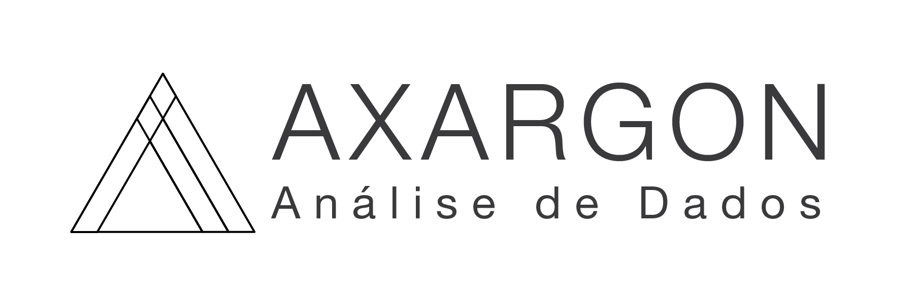

   

  

# Alex Arantes Gonçalves
*Estudante de Ciência de dados* na Univesp

Como experiente profissional em Ciências aplicadas com mais de 17 anos de experiência, possuo uma combinação de habilidades analíticas, capacidade de trabalho em equipe e atenção aos detalhes. Tendo recentemente direcionado minha carreira com sucesso para a área de Análise de dados, tenho adquirido as habilidades de extrair, transformar e carregar os mesmos de diversas origens e formatos para estruturas de dados em ambientes analiticos, e utiliza-los para criação de *dashboards* para visualização de informações.

No momento estou trabalhando na minha segunda graduação em Bacharelado de Ciência de dados na UNIVESP de São Paulo, eu já possuo Bacharelado em Ciência e Tecnologia pela Universidade Federal do ABC, uma das mais prestigiadas Universidades brasileiras.

**Experiência em:** Consolidação e visualização de dados, programação em Python, e diversas técnicas de Ciência de dados.

**Links:**

* [LinkedIn](https://www.linkedin.com/in/alexarantesgoncalves/?locale=pt_BR)

# Projetos:
Veja os lista de alguns projetos construidos com Slemma:

* **[Volume de inspeções](https://slemma.com/share/eca68174d41f8af8f5f1f23827f0ec858d34d365)**
  * Um dos dashboards mais utlizados para controle de volume de inspeção em diversos clientes, este dashboard possui diversas abas superiores para acesso de diferentes pontos de vista dos dados, temporal, usuário, localização e consumo de insumos. *[clique aqui](https://slemma.com/share/eca68174d41f8af8f5f1f23827f0ec858d34d365)*
* **[Volume de inspeções II](https://slemma.com/share/fce37a61af0330a61f380273c896392486e55329)**
  * A mesma solicitação anterior para um outro cliente que requisitou background negro para projetar o dashboard em uma TV. As Abas com diferentes pontos de vista dos dados estão agora no canto inferior direito. *[clique aqui](https://slemma.com/share/fce37a61af0330a61f380273c896392486e55329)*
* **[Inspeções Sócio Ambientais](https://slemma.com/share/759a9137e9afc984809e76435d56356c136b96ed)**
  * Dash para controle de não conformidades sócio ambientais. Os KPIs solicitados pelo cliente por fórmula especifica leva em consideração gravidade e localização das não conformidades. Na última aba é possível encontrar uma tabela intearativa que descreve os detalhes das não conformidades filtradas.  *[clique aqui](https://slemma.com/share/759a9137e9afc984809e76435d56356c136b96ed)*
* **[Volume de inspeções por geolocalização](https://slemma.com/share/a728033985c2529d91de887bf4e997750aaa6f8b)**
  * Aproveitando-se dos dados coletados com o gps dos sistemas mobile ativados, foi possivel construir este dash com integração ao googlemaps por meio de um API ja embutido no sistema. O cliente necessitava de saber onde as inspeções estavam sendo realizadas. É possível escolher o tipo de inspeção, categoria e data para interagir com o mapa. *[clique aqui](https://slemma.com/share/a728033985c2529d91de887bf4e997750aaa6f8b)*

<!-- **Como Implementar Regressão Linear com Python:** https://bit.ly/2Li5pzY
* **Data Science: Investigando o naufrágio do Titanic:** https://bit.ly/2Ubr5SH
* **Como Tratar Dados Ausentes com Pandas:** https://bit.ly/31KWSMN
* **XGBoost: aprenda este algoritmo de Machine Learning em Python:** https://bit.ly/2UbRhws
* **Como criar uma Wordcloud em Python:** https://bit.ly/2OxsphM
* **Como lidar com dados desbalanceados:** https://bit.ly/2ZlaNsV-->
